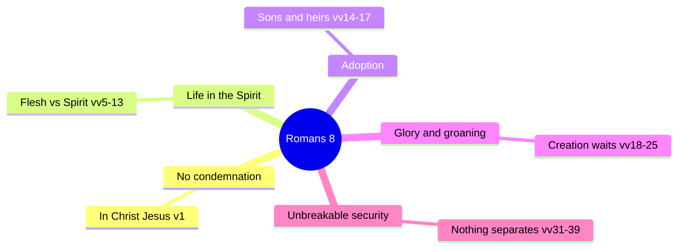
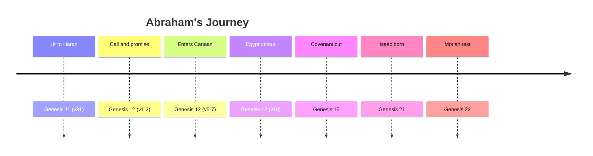
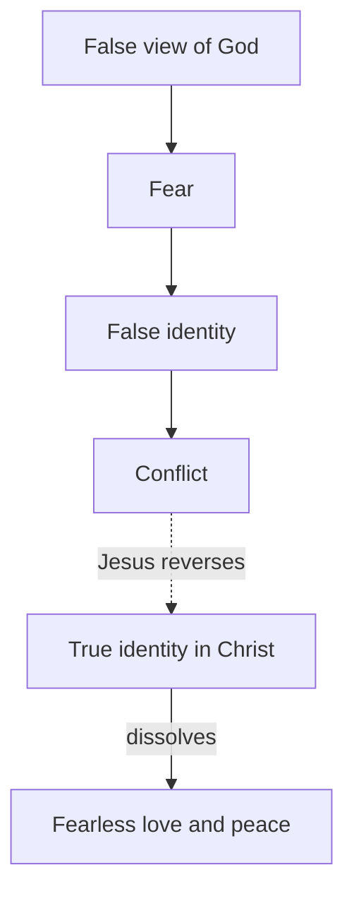
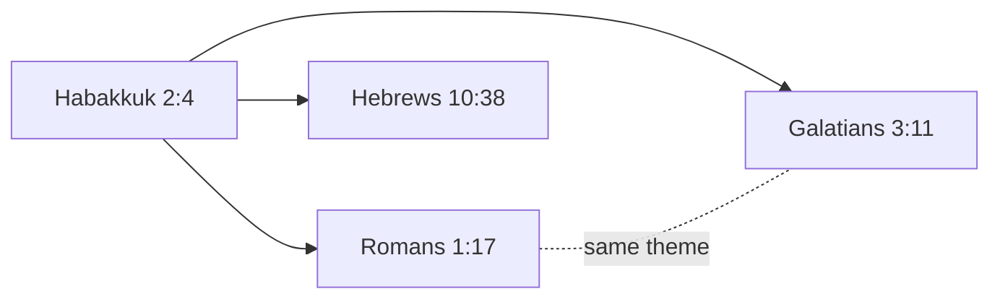
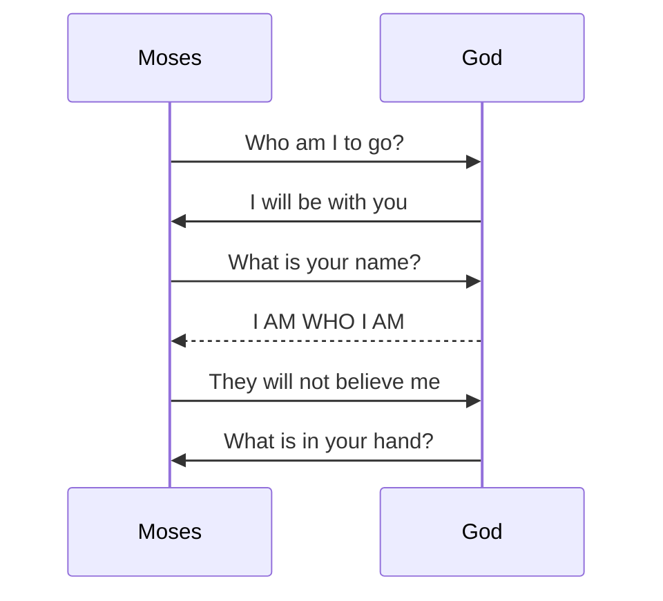
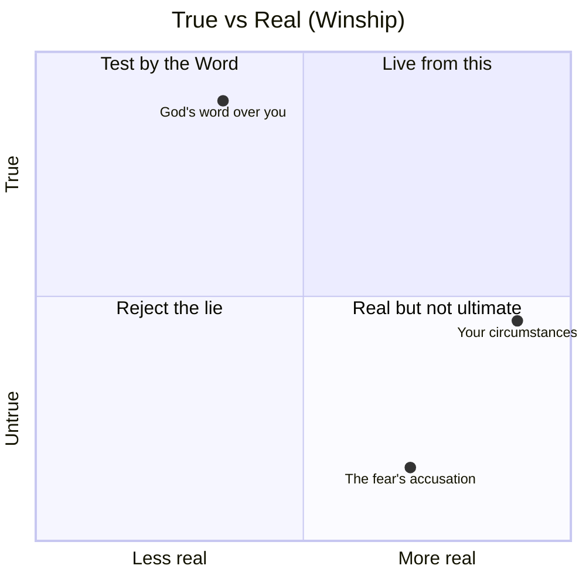
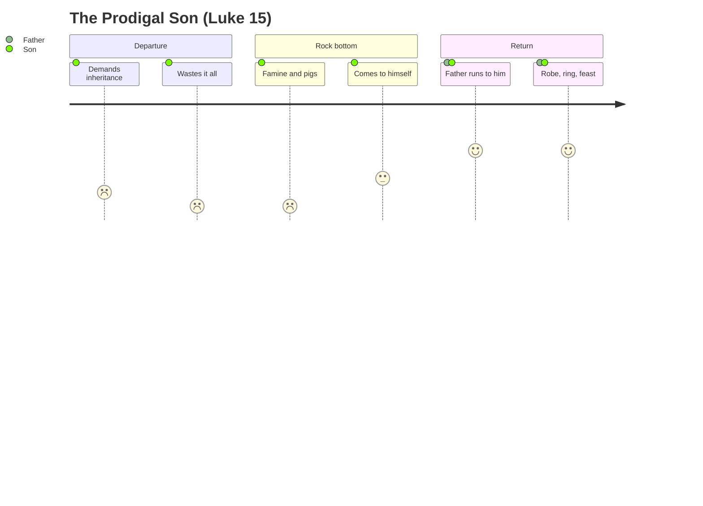

# Diagram Catalog

Worked templates for `_visualize_this`. Each entry: **when to use**, a **biblical example** with valid Mermaid (or text), and **gotchas**. All examples render on GitHub, VS Code (Markdown Preview Mermaid Support), and Obsidian.

Global rules: ≤ 7±2 nodes per cluster · 1–5 word labels · direction and grouping must *encode* meaning · every node traces to a verse or named source.

---

## 1. Mind map — one concept broken into parts

**Use for:** a chapter's themes, a teacher's framework, a word's semantic range, the facets of a doctrine.



**Gotchas:** the root needs a shape wrapper — `root((text))`, `root(text)`, or `root[text]`. Indentation defines hierarchy; keep it consistent. No `:` needed. Avoid parentheses inside child text.

---

## 2. Timeline — events in order

**Use for:** a life, a journey, a reign, redemptive history, a book's plot.



**Gotchas:** the `:` is the period/event separator — **do not** put a chapter:verse colon inside event text. Write `Genesis 12 (v1-3)`, never `Gen 12:1-3`. One `title` line, optional.

---

## 3. Flowchart — argument, process, or cause → effect

**Use for:** the logic of an epistle, a narrative's causation, a ritual sequence, a teacher's causal model.



*(This is Winship's fear→conflict chain and its reversal — straight from `resources/teachers/jamie-winship/notes.md`.)*

**Gotchas:** `TD` = top-down, `LR` = left-right (use `LR` when labels are long). Quote any label with punctuation: `A["Sin (Rom 3:23)"]`. Edge labels: `-->|text|`. Dotted edge: `-. text .->`.

---

## 4. Network graph — relationships among many entities

**Use for:** a cross-reference web, a citation network (one OT verse quoted across the NT), character relationships.



**Gotchas:** same engine as `flowchart`. Quote labels containing `:`. Solid `-->` for direction (who cites whom); `-.-` for undirected association. Don't exceed ~12 nodes — split into clusters with `subgraph Name … end`.

---

## 5. Sequence — a back-and-forth between parties

**Use for:** a dialogue, an intercession, a courtroom or covenant transaction.



**Gotchas:** declare `participant X as Label` to keep short keys. `->>` solid arrow, `-->>` dashed reply. Keep message text short — no `:` problems here, but avoid line breaks.

---

## 6. Quadrant — comparison along two dimensions

**Use for:** two-axis sorting — e.g., Winship's *true vs. real*, faith/works, known/done.



**Gotchas:** points are `Label: [x, y]` with x,y in 0–1. Exactly four `quadrant-1..4`. Axis lines use `-->`. No quotes around point labels (keep them colon-free).

---

## 7. Journey — a spiritual / emotional arc

**Use for:** a character's rise and fall, the felt shape of a psalm, a conversion.



**Gotchas:** each task is `Text: score: Actor(s)` where score 1–5 is the emotional level. The `:` separators are required here (unlike timeline). Actors comma-separated.

---

## 8. Comparison table — items across features

**Use for:** the covenants, the kings, the feasts, Synoptic parallels, the "I AM" sayings. When a grid beats a graph, use a table.

| Covenant | Party | Sign | Key text |
|---|---|---|---|
| Noahic | All flesh | Rainbow | Gen 9:8-17 |
| Abrahamic | Abraham's seed | Circumcision | Gen 17 |
| Mosaic | Israel | Sabbath | Exod 19-24 |
| Davidic | David's line | Throne forever | 2 Sam 7 |
| New | All in Christ | Spirit / Supper | Jer 31; Luke 22 |

**Gotchas:** plain markdown — renders everywhere, no Mermaid needed. Keep cells to a few words; verse refs, not quotations.

---

## 9. Chiasm / inclusio — mirrored literary structure

**Use for:** Hebrew concentric structures. Mermaid handles these poorly; use an **indented text diagram** in a code block so the mirror is visible.

```text
A   Worship the LORD's name (Ps 8:1)
  B   Heavens, infants, foes (vv1-2)
    C   What is man? (vv3-4)
    C'  Crowned with glory and dominion (vv5-6)
  B'  All creatures under his feet (vv7-8)
A'  Worship the LORD's name (v9)
```

**Gotchas:** ind&#173;ent each level one more step; mark the mirror with primes (A / A'). Put the **pivot** (the turn) at the deepest indent — it's usually the point. For a true single-center chiasm (A-B-C-B'-A'), the lone center line carries the emphasis.

---

## Rendering backends (optional)

- **Inline markdown** (default): the ` ```mermaid ` block renders in GitHub, VS Code, Obsidian.
- **Mermaid Chart MCP** — `validate_and_render_mermaid_diagram` validates syntax and produces a rendered image; use when you want an image file or want to confirm tricky syntax.
- **Excalidraw MCP** — `create_view` / `export_to_excalidraw` for a hand-drawn, freeform style when the structure is spatial (a tabernacle layout, a map sketch) rather than graph-like.
